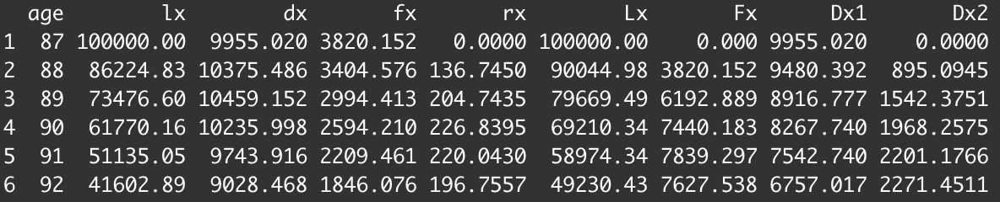
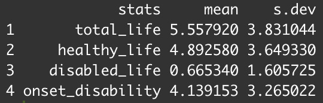

# Workflow Example

The following is an example of the general workflow of the module. It demonstrates
the order of function executions, and the different endpoint outputs. We use the following
individual characteristics:

* male
* age 87
* initial year 2022
* trend model 
* healthy 
* use parameters estimated from the US study: `US_HRS`


```r
# first we create a list of transition probability matrices 
trans_probs <- get_trans_probs('T', US_HRS, 87, female = 0, 2022)

# using the transition probabilities, we can generate life tables
life_table <- create_life_table(trans_probs, 87, init_state = 0)
head(life_table)
```

<figure markdown>
  
</figure>

```r
# can also create a plot of mortality and disability curves
prob_plots(init_state = 0, 87, trans_probs)
```

<figure markdown>
  
</figure>

```r
# from transition probabilities, we can simulate lifetime paths
sim_paths <- simulate_path(87, init_state = 0, trans_probs, cohort = 10000)

# statistics (mean and standard deviation): 

# average future lifetime
future_life <- afl(87, init_state = 0, trans_probs)

# healthy future lifetime
healthy_life <- hfl(87, init_state = 0, trans_probs)

# average future lifetime spent in disabled state
disabled_life <- afld(87, init_state = 0, trans_probs)

# time until onset of disability 
first_disabled <- time_to_disabled(87, trans_probs)

# all survival statistics (essentially all of the above outputted in one dataframe)
survival_stats(87, init_state = 0, trans_probs)
```

<figure markdown>
  
</figure>


!!! note
    If we used the frailty model, then the transition probabilities, lifetable, and 
    plots will also be stochastic, in addition to another layer of randomness in the other
    simulated variables. Also use corresponding frailty version of the statistics functions 
    for the extra layer of randomness. See [3 state stats](stats.md).